# Dungeon - Turn-Based RPG on the AK Embedded Base Kit

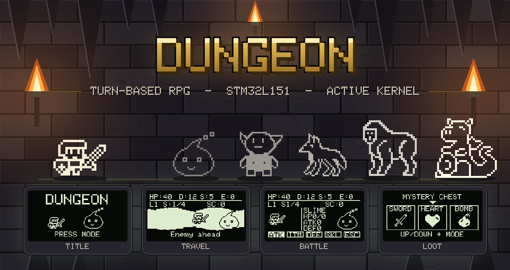

> Every screen in this banner is a real framebuffer dump produced by the firmware itself, not a mockup.

---

## Table of Contents

| Section | Contents |
| --- | --- |
| [I. Hardware](#i-hardware) | Board, MCU, memory map |
| [II. Screens and Game Objects](#ii-screens-and-game-objects) | Every screen, every sprite |
| [III. How to Play](#iii-how-to-play) | Controls, actions, balance tables, **gameplay loop** |
| [IV. Boot and Initialisation](#iv-boot-and-initialisation) | **Reset vector to first frame** |
| [V. Software Architecture](#v-software-architecture) | **Task map, scheduler, message routing** |
| [VI. Screen Flow](#vi-screen-flow) | **Screen transition graph** |
| [VII. Input Pipeline](#vii-input-pipeline) | **Button ISR to game action** |
| [VIII. One Game Tick](#viii-one-game-tick) | **100 ms tick sequence** |
| [IX. Rendering Pipeline](#ix-rendering-pipeline) | **Draw call to OLED, frame rate cap** |
| [X. Combat Turn State Machine](#x-combat-turn-state-machine) | **Turn phases, cross-task handover** |
| [XI. Save System and Power-Loss Safety](#xi-save-system-and-power-loss-safety) | **Save triggers, restore decision, verification** |
| [XII. Build and Flash](#xii-build-and-flash) | Toolchain, flashing, serial log |
| [XIII. Desktop Simulator](#xiii-desktop-simulator) | Run the firmware on macOS or Linux, no board |

**Bold** entries contain a diagram.

---

## Documentation

The source walkthrough is written in Vietnamese; this README is the English entry point.

| File | Description |
| --- | --- |
| [README.md](README.md) | Project overview, hardware, gameplay, architecture diagrams, build guide |
| [docs/giai-thich-source/00-tong-quan.md](docs/giai-thich-source/00-tong-quan.md) | Repository map and the 30-second mental model |
| [docs/giai-thich-source/01-kernel-ak.md](docs/giai-thich-source/01-kernel-ak.md) | The AK kernel: task table, priority bitmap, message pools, software timers |
| [docs/giai-thich-source/02-khoi-dong-va-bo-nho.md](docs/giai-thich-source/02-khoi-dong-va-bo-nho.md) | Reset vector to `main()`, flash and RAM layout |
| [docs/giai-thich-source/03-platform-va-driver.md](docs/giai-thich-source/03-platform-va-driver.md) | Pin map, OLED / EEPROM / NOR flash / button / buzzer drivers |
| [docs/giai-thich-source/04-tang-application.md](docs/giai-thich-source/04-tang-application.md) | Screen manager, layout system, screen inventory |
| [docs/giai-thich-source/05-game-dungeon.md](docs/giai-thich-source/05-game-dungeon.md) | Game logic, turn state machine, save format and power-loss safety |
| [docs/giai-thich-source/06-bootloader.md](docs/giai-thich-source/06-bootloader.md) | Bootloader, BSF shared partition, firmware update path |
| [docs/giai-thich-source/07-networks-link.md](docs/giai-thich-source/07-networks-link.md) | Optional PHY / MAC / LINK UART stack |
| [docs/giai-thich-source/08-bao-ve-rtos.md](docs/giai-thich-source/08-bao-ve-rtos.md) | Talking points for defending the RTOS design |
| [docs/giai-thich-source/09-dung-moi-truong-va-nap-bo.md](docs/giai-thich-source/09-dung-moi-truong-va-nap-bo.md) | Toolchain setup and flashing, step by step |
| [docs/giai-thich-source/10-huong-dan-mo-rong.md](docs/giai-thich-source/10-huong-dan-mo-rong.md) | How to add a task, a screen, a monster, an item |
| [docs/giai-thich-source/11-mo-xe-tung-dong.md](docs/giai-thich-source/11-mo-xe-tung-dong.md) | Line-by-line reading of the hardest functions |
| [docs/giai-thich-source/12-go-loi.md](docs/giai-thich-source/12-go-loi.md) | Debugging playbook by symptom |

---

## Introduction

**Dungeon** is a turn-based RPG built on the **AK Embedded Base Kit (STM32L151)** and the **Active Kernel (AK)** — a cooperative, run-to-completion event framework. The hero walks a dungeon corridor, opens chests, and fights a monster at the end of every stage. Clear all stages in a level to win; drop to 0 HP and the run ends.

What sets this project apart from the other games in the AK series:

- **Turn-based, not reflex-based.** The interesting problem here is not collision detection — it is modelling a complete combat turn as a state machine that survives being interrupted at any point, on a kernel with no preemption and a single shared stack.
- **Six concurrent game tasks, not one.** Corridor, combat, monster AI, input, and visual effects each own a separate AK task at `TASK_PRI_LEVEL_4`. They coordinate by message passing; there is exactly one deliberate exception, documented in [section X](#x-combat-turn-state-machine).
- **The whole run is persistent.** Every meaningful state change is written to the internal EEPROM: level, stage, HP, inventory, active status effects, and which turn phase the fight is in. Pull the power mid-battle and **Continue** puts you back exactly where you were.
- **Power-loss safety is tested, not assumed.** A host-side harness compiles the real kernel and the real game logic against stub hardware, then sweeps **3072 possible save states**, restoring each one and checking the game can still make progress. Current result: **0 unrecoverable states**. See [section XI](#xi-save-system-and-power-loss-safety).
- **Static memory discipline.** Zero heap allocation on the game path. Fixed message pools (32 pure / 8 common / 8 dynamic), a 1024-byte framebuffer, and a 16-entry timer pool, all inside 16 KB of RAM.
- **One layout system for every screen.** All twelve screens draw through the shared constants in `screens_layout.h`. An automated checker dumps each framebuffer and scans every pixel to prove nothing breaks the 3 px margin.
- **The whole thing runs on a laptop.** `tools/simulator/` builds the real kernel and the real game against stub hardware, so you can play it in a terminal or a browser without a board — and pull the power at any exact millisecond with `kill -9`.

---

## I. Hardware

|  |
| --- |

***Figure 1:*** AK Embedded Base Kit - STM32L151

The [AK Embedded Base Kit](https://epcb.vn/products/ak-embedded-base-kit-lap-trinh-nhung-vi-dieu-khien-mcu) is an evaluation board for advanced embedded software study. It carries a **1.54" 128x64 OLED**, **4 push buttons** (Reset, Up, Down, Mode), a **buzzer** able to play tonal sequences, and a **W25Q80 NOR flash**, plus RS485, Qwiic, and Grove headers.

| Component | Part | Role in this project |
| --- | --- | --- |
| MCU | STM32L151CBT6 | 32 MHz Cortex-M3, 128 KB flash, 16 KB RAM |
| Display | SSD1309 128x64 OLED | Bit-banged I2C, SSD1306-compatible command set, 1024-byte framebuffer |
| External flash | Winbond W25Q80 | Fatal log, bootloader share, firmware images |
| Internal EEPROM | 4 KB on-die | Settings, best score, in-progress save |
| Input | 4 push buttons | Reset, Up, Down, Mode - polled every 10 ms |
| Audio | Passive buzzer | Tone sequences on hit, win, and menu events |

**MCU overview**

```text
SoC Name : STM32L151CBT6
RAM      : 16 KB
Clock    : 32 MHz

Flash Partitions Layout
-----------------------
[ 0x08000000 - 0x08001FFF ] : Bootloader Partition (8 KB)
=> AK Bootloader

[ 0x08002000 - 0x08002FFF ] : BSF Shared Partition (4 KB)
=> Data shared between bootloader and application

[ 0x08003000 - 0x0801FFFF ] : Application Partition (116 KB)
=> Dungeon firmware

[ 0x08080000 - 0x08080FFF ] : Internal EEPROM (4 KB)
=> Settings, best score, in-progress save
```

**MCU naming convention**

| Part | Meaning |
| --- | --- |
| `STM32` | STMicroelectronics 32-bit MCU family |
| `L` | Low-power series |
| `151` | STM32L151 product line |
| `C` | 48-pin package |
| `B` | 128 KB flash memory |
| `T` | LQFP package |
| `6` | Industrial temperature grade |

|  |
| --- |

***Figure 2:*** Board view, top and bottom

---

## II. Screens and Game Objects

Power-on sequence: **AK Kernel logo** (2 s, or press Mode to skip) → **Title** (waits for Mode) → **Main Menu**.

| 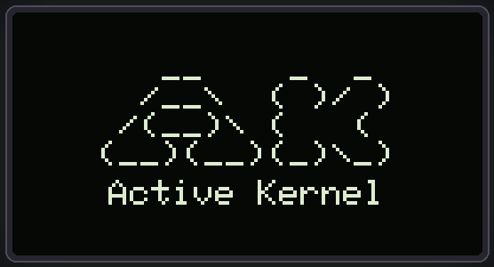 | 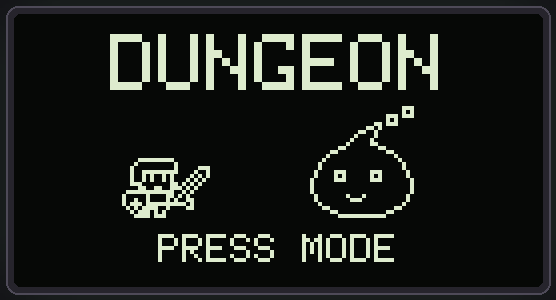 |
| --- | --- |
| ***Figure 3:*** AK Kernel splash | ***Figure 4:*** Title screen, `PRESS MODE` blinks at 1 Hz |

| 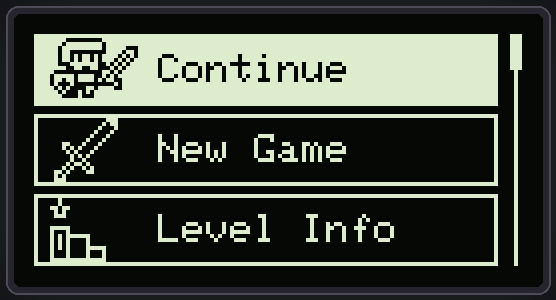 |
| --- |

***Figure 5:*** Main menu - a three-card scrolling list with a proportional scroll bar

The menu offers six entries. **Continue** is hidden when no valid save exists:

| Entry | Action |
| --- | --- |
| **Continue** | Resume the saved run, exactly where it stopped |
| **New Game** | Start from Level 1 and erase the current save |
| **Level Info** | Inspect a level's difficulty and stage count |
| **LeaderBoard** | Best score and furthest level / stage reached |
| **Creator Mode** | Play any level as a test run; nothing is written to EEPROM |
| **Settings** | Party size, lane speed, silent mode |

| 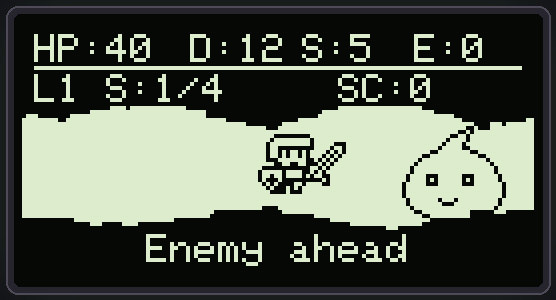 | 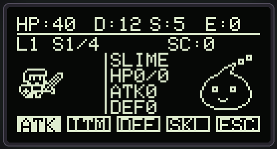 |
| --- | --- |
| ***Figure 6:*** Travel - the corridor band deliberately bleeds to both edges | ***Figure 7:*** Battle - hero on the left, monster and its stats on the right |

| 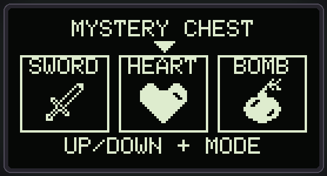 | 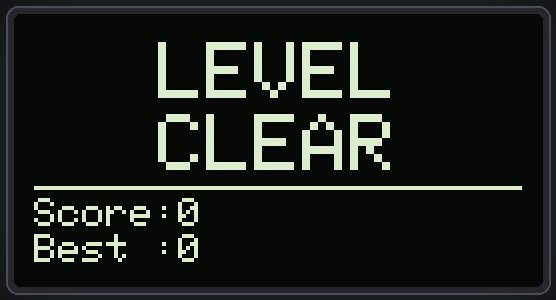 |
| --- | --- |
| ***Figure 8:*** Mystery chest - three options, pick one | ***Figure 9:*** Level cleared |

### Objects in the game

| Bitmap | Object | Description |
| :---: | --- | --- |
|  | **Hero** | 24x17 px. Walks the corridor automatically, fights in turns. Stats scale with level: `HP = 35 + level*5`, `ATK = 10 + level*2`, `DEF = 4 + level`. |
|  | **Slime** | Regenerates **+5 HP every even turn**. The tutorial enemy — it opens every level. |
|  | **Goblin** | Applies **Poison** (3 turns) starting turn 2, then every 3 turns. |
|  | **Wolf** | Arms a **dodge** starting turn 3, then every 4 turns. Your next Attack misses entirely; Skill still lands. |
|  | **Gorilla** | Gains **+5 armor** starting turn 2, then every 3 turns. Bring a Bomb or the fight stalls. |
| 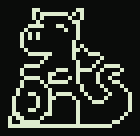 | **Dragon** | **10 flat damage + Burn** (3 turns) starting turn 3, then every 4. Escape always fails. |
|  | **Eye Watcher** | Applies **Curse** (3 turns), halving all healing. Final boss of Level 5. Escape always fails. |

| Item | Effect | Scaling |
| --- | --- | --- |
|  **Sword** | Permanent `ATK +5` | `+3` per level above 1 |
|  **Shield** | Permanent `DEF +5` | `+4` per level above 1 |
|  **Heart** | Restore `5 HP` | `+2` per level above 1, halved while Cursed |
|  **Bomb** | Enemy armor `-3` | `+2` per level above 1 |
| **Poison** | Enemy takes `5` damage per turn for 3 turns | `+2` per level above 1 |
| **Antidote** | Clears Poison and Burn | — |
| **Purify** | Clears Curse | — |

> **Note:** every number above is read directly from `dungeon_lane.cpp`, `dungeon_state.cpp`, `dungeon_action.cpp` and `dungeon_control.cpp`. If you change a formula, update this table.

---

## III. How to Play

| Button | Travel | Chest | Battle | Message box |
| --- | --- | --- | --- | --- |
| **Up** | — | Move selection left | Move action left | — |
| **Down** | — | Move selection right | Move action right | — |
| **Mode** | — | Take the item | Confirm the action | Continue |
| **Reset** | Hard reset the board | | | |

Five combat actions, selected with Up / Down and confirmed with Mode:

| Action | Effect |
| --- | --- |
| **ATK** | `damage = ATK - enemy_armor/2`, minimum 1 |
| **ITM** | Auto-picks the most useful item you hold: cures first, then heal, then offensive |
| **DEF** | Halves the incoming hit, this turn only |
| **SKL** | `damage = ATK + 4 + level*2 - enemy_armor/3`. Bypasses the Wolf's dodge |
| **ESC** | Skip the stage, `+5` score. Fails when `(level + stage + turn) % 3 == 0`, and always fails against Dragon and Eye Watcher |

### Gameplay loop

One stage is always the same shape: walk, meet a chest, walk again, meet the monster. The boss stage of each level gives two chests instead of one, because `support_event` is seeded to 2 there.

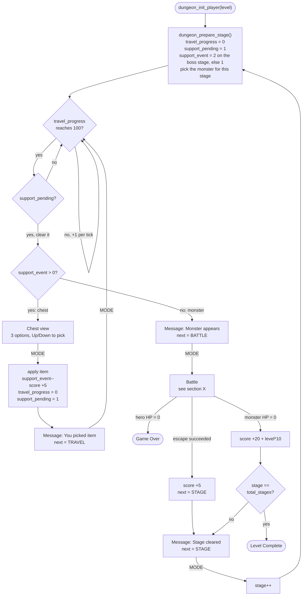

**Level progression**

| Level | Difficulty | Stages | Monster order |
| :---: | :---: | :---: | --- |
| 1 | Easy | 4 | Slime → Goblin → Wolf → Gorilla |
| 2 | Easy | 5 | Slime → Slime → Goblin → Wolf → Gorilla |
| 3 | Medium | 6 | Slime → Goblin → Goblin → Wolf → Gorilla → **Dragon** |
| 4 | Medium | 7 | Slime → Goblin → Goblin → Wolf → Wolf → Gorilla → **Dragon** |
| 5 | Hard | 8 | Slime → Goblin → Goblin → Wolf → Gorilla → Gorilla → Dragon → **Eye Watcher** |

**Monster balance**

| Monster | HP | DMG | Armor | Special | First turn | Period |
| --- | :---: | :---: | :---: | --- | :---: | :---: |
| Slime | `30 + (lvl-1)*3` | 5 | 1 | Heal +5 | 2 | every 2 |
| Goblin | 50 | `10 + (lvl-1)*2` | 2 | Poison, 3 turns | 2 | every 3 |
| Wolf | 70 | 30 | 1 | Dodge next Attack | 3 | every 4 |
| Gorilla | 90 | 40 | `4 + lvl*2` | Armor +5 | 2 | every 3 |
| Dragon | 150 | 50 | `7` or `(lvl-2)*7` | 10 damage + Burn, 3 turns | 3 | every 4 |
| Eye Watcher | 200 | 60 | 12 | Curse, 3 turns | 3 | every 3 |

Incoming damage is `monster_dmg - hero_DEF/2`, halved again if you chose **DEF** that turn, with a floor of 1.

**Status effects**

| Effect | Applied by | Effect per turn | Duration |
| --- | --- | --- | :---: |
| Poison | Goblin | Hero loses 5 HP | 3 turns |
| Burn | Dragon | Hero loses 5 HP | 3 turns |
| Curse | Eye Watcher | Healing is halved | 3 turns |
| Enemy Poison | Poison item | Enemy loses `5 + (lvl-1)*2` HP | 3 turns |

**Scoring:** `+20 + level*10` per monster defeated, `+5` per chest opened, `+5` per successful escape. The current score, the best score, and the furthest level / stage are all persisted.

**Screen saver:** after 20 s idle on a menu screen the display switches to a bouncing-ball animation to protect the OLED from burn-in.

---

## IV. Boot and Initialisation

Reset lands in the bootloader, not the application. The bootloader validates the app partition, then jumps to `main_app()` in `app/app.cpp`. Note the order inside `main_app()`: the kernel is created **first**, so `task_post()` is legal from any driver init that follows.

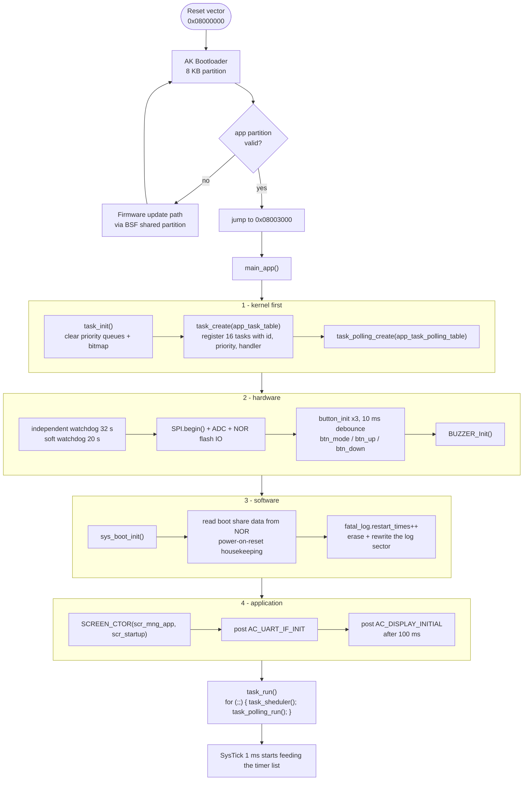

`task_run()` never returns. Everything after this point is driven by messages arriving in the priority queues.

---

## V. Software Architecture

AK is a **cooperative** kernel, not a preemptive RTOS. Every task handler runs to completion on a single shared stack, so there are no per-task stacks, no context switches, and no mutexes anywhere in this project. Concurrency is expressed as messages between tasks.

### V.1 Task map and priorities

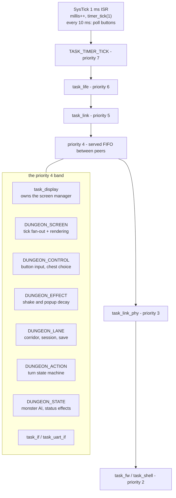

| Task | Priority | Responsibility |
| --- | :---: | --- |
| `TASK_TIMER_TICK` | 7 | Drains the software timer list, posts expired timer messages |
| `task_life` | 6 | Watchdog kick, heartbeat LED |
| `task_link` | 5 | LINK layer *(optional, `IF_LINK_UART_EN`)* |
| `task_display` | 4 | Screen manager entry point, dispatches to the current screen |
| `DUNGEON_SCREEN` | 4 | Fans a tick out to the game tasks, renders the frame |
| `DUNGEON_CONTROL` | 4 | Button input, selection movement, chest pickup |
| `DUNGEON_EFFECT` | 4 | Shake and damage-popup countdowns |
| `DUNGEON_LANE` | 4 | Corridor progress, session lifecycle, EEPROM save |
| `DUNGEON_ACTION` | 4 | Combat turn state machine |
| `DUNGEON_STATE` | 4 | Per-monster AI, status effect ticking |
| `task_if` / `task_uart_if` | 4 | Serial interface plumbing |
| `task_link_phy` | 3 | PHY layer *(optional)* |
| `task_fw` / `task_shell` | 2 | Firmware update and debug shell |

> Priority level 0 is reserved by the kernel. `task_post()` indexes `task_pri_queue[pri - 1]`, so a task registered at level 0 would underflow the array. The lowest usable level is 2.

### V.2 How the scheduler picks the next message

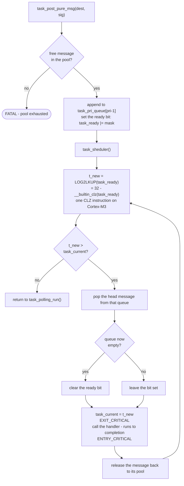

The `t_new > task_current` comparison is what makes the kernel cooperative: a task cannot be re-entered from inside its own handler, and a same-priority peer waits its turn. That is also why **posting order equals execution order** among the six game tasks — they all sit at level 4.

### V.3 Message routing

Every arrow is a `task_post_pure_msg()` call in the source. There are no direct calls between game tasks.

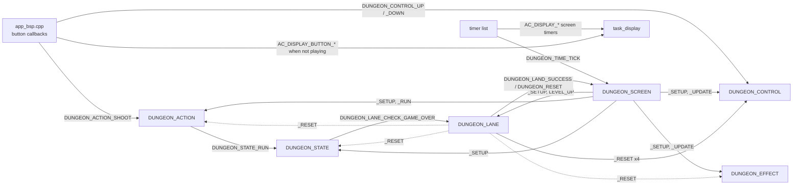

| Signal | From | To | Meaning |
| --- | --- | --- | --- |
| `DUNGEON_TIME_TICK` | timer | `DUNGEON_SCREEN` | 100 ms heartbeat, fanned out below |
| `DUNGEON_CONTROL_UPDATE` | `DUNGEON_SCREEN` | `DUNGEON_CONTROL` | Advance walk-cycle animation |
| `DUNGEON_EFFECT_UPDATE` | `DUNGEON_SCREEN` | `DUNGEON_EFFECT` | Decay shake and popup counters |
| `DUNGEON_LANE_LEVEL_UP` | `DUNGEON_SCREEN` | `DUNGEON_LANE` | Advance corridor progress |
| `DUNGEON_ACTION_RUN` | `DUNGEON_SCREEN` | `DUNGEON_ACTION` | Advance the turn state machine |
| `DUNGEON_ACTION_SHOOT` | button | `DUNGEON_ACTION` | Mode pressed while playing |
| `DUNGEON_CONTROL_UP` / `_DOWN` | button | `DUNGEON_CONTROL` | Move the selection |
| `DUNGEON_STATE_RUN` | `DUNGEON_ACTION` | `DUNGEON_STATE` | Resolve the monster's turn |
| `DUNGEON_LANE_CHECK_GAME_OVER` | `DUNGEON_STATE` | `DUNGEON_LANE` | Hero reached 0 HP |
| `DUNGEON_LAND_SUCCESS` / `DUNGEON_RESET` | `DUNGEON_LANE` | `DUNGEON_SCREEN` | Run finished, win or lose |

### V.4 Memory budget

| Pool | Count | Size each | Purpose |
| --- | :---: | :---: | --- |
| Pure messages | 32 | header only | Signals with no payload |
| Common messages | 8 | 64 B | Small payloads |
| Dynamic messages | 8 | heap, 128 B | Variable payloads, drained immediately |
| Software timers | 16 | — | One-shot and periodic |
| Framebuffer | 1 | 1024 B | 128x64 monochrome, pushed over I2C |

**Two-tier software timer.** The 1 ms ISR must never post more than one message per tick or the pure pool drains during a stall. It accumulates elapsed milliseconds in a counter and posts at most one `TIMER_TICK`, guarded by an `enable_post_msg` flag; the timer task then subtracts the whole accumulated interval at once.

---

## VI. Screen Flow

Generated from the `SCREEN_TRAN()` calls in `application/sources/app/screens/`.

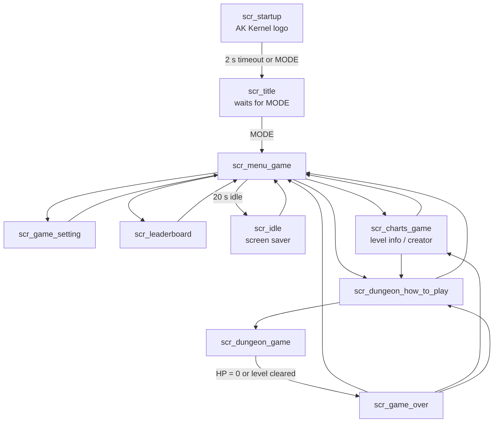

`scr_dungeon_game` is the only screen with no direct route back to the menu — it must pass through `scr_game_over`, which is where the score is committed to EEPROM.

The screen manager itself is a single function pointer plus a view object. `SCREEN_TRAN()` swaps both, then synthesises a `SCREEN_ENTRY` message into the new handler and renders immediately.

```c
void scr_mng_tran(screen_f target, view_screen_t* scr_obj) {
    view_screen = scr_obj;                       /* what to draw */
    screen_manager->screen = target;             /* who handles messages */
    screen_manager->screen(&screen_msg_entry);   /* SCREEN_ENTRY */
    view_render_screen(view_screen);
}
```

> There is **no** `SCREEN_EXIT`. A screen that armed a periodic timer must remove it itself before calling `SCREEN_TRAN`, or the timer keeps firing forever. `scr_title` and `scr_idle` both do this; see `title_stop_blink()`.

Regenerate the edge list after adding a screen:

```bash
cd application/sources/app/screens
for f in *.cpp; do
  t=$(grep -oE "SCREEN_TRAN\(scr_[a-z_]+_handle" $f | sed 's/SCREEN_TRAN(scr_//;s/_handle//' | sort -u | tr '\n' ' ')
  [ -n "$t" ] && printf "%-28s -> %s\n" "${f%.cpp}" "$t"
done
```

---

## VII. Input Pipeline

Buttons are never read in an interrupt. The 1 ms SysTick counts to 10, then runs the debounce state machine for all three buttons in a polling context. The routing decision at the end is the part worth studying: the **same physical button** produces a different signal depending on whether a run is live.

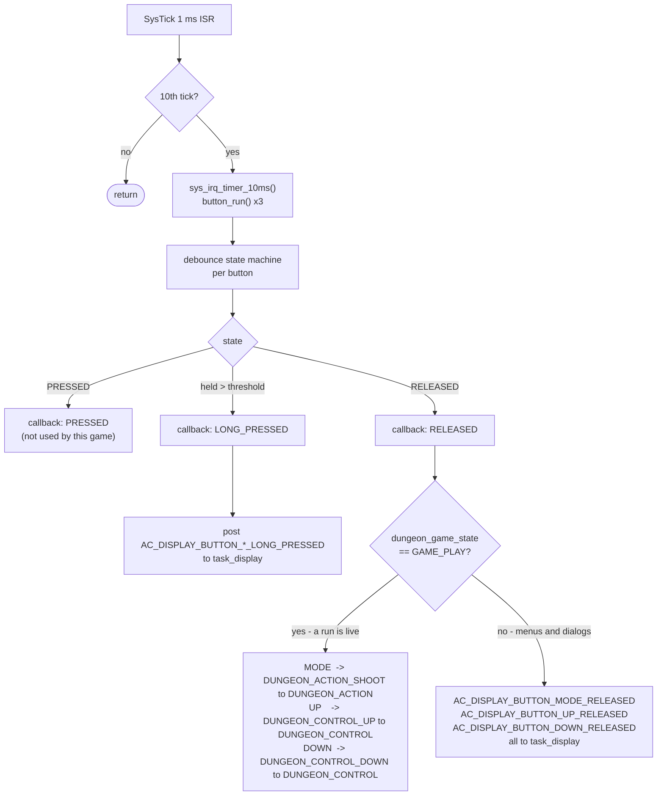

```c
case BUTTON_SW_STATE_RELEASED:
    if (dungeon_game_state == GAME_PLAY) {
        task_post_pure_msg(DUNGEON_ACTION_ID, DUNGEON_ACTION_SHOOT);
    }
    else {
        task_post_pure_msg(AC_TASK_DISPLAY_ID, AC_DISPLAY_BUTTON_MODE_RELEASED);
    }
    break;
```

This split keeps the game screen's message handler tiny — while playing it only handles the tick and the end-of-run transition, because input never reaches it. It is also the first thing to check when a button "does nothing": confirm which of the two branches the press actually took, using the serial log.

---

## VIII. One Game Tick

A periodic 100 ms timer drives the whole game. `DUNGEON_SCREEN` receives it and fans it out to four tasks **in a fixed order**. All four sit at `TASK_PRI_LEVEL_4`, so AK serves them FIFO — posting order *is* execution order. Effects decay before the turn machine advances, exactly as when a single monolithic `dungeon_tick()` did both jobs.

```mermaid
sequenceDiagram
    autonumber
    actor P as Player
    participant AK as AK kernel
    participant Scr as DUNGEON_SCREEN
    participant Ctl as DUNGEON_CONTROL
    participant Eff as DUNGEON_EFFECT
    participant Lan as DUNGEON_LANE
    participant Act as DUNGEON_ACTION
    participant Sta as DUNGEON_STATE
    participant EE as EEPROM

    rect rgb(24,40,26)
        Note left of P: SCREEN_ENTRY
        AK->>Scr: SCREEN_ENTRY
        Scr->>Lan: DUNGEON_LANE_SETUP
        Lan->>EE: dungeon_save_read()
        EE-->>Lan: saved run, or "none"
        Lan->>Lan: sanitize_restored_state()
        Scr->>Ctl: DUNGEON_CONTROL_SETUP
        Scr->>Act: DUNGEON_ACTION_SETUP
        Scr->>Eff: DUNGEON_EFFECT_SETUP
        Scr->>Sta: DUNGEON_STATE_SETUP
        Scr->>AK: timer_set(DUNGEON_TIME_TICK, 100 ms, PERIODIC)
    end

    rect rgb(40,26,44)
        Note left of P: every 100 ms
        AK->>Scr: DUNGEON_TIME_TICK
        Scr->>Ctl: DUNGEON_CONTROL_UPDATE
        Scr->>Eff: DUNGEON_EFFECT_UPDATE
        Scr->>Lan: DUNGEON_LANE_LEVEL_UP
        Lan->>Lan: advance_travel()
        Scr->>Act: DUNGEON_ACTION_RUN
        Act->>Act: dungeon_tick() - advance the turn phase
        Act->>EE: dungeon_save_write()
        Scr->>Scr: scr_mng_render_screen()
    end

    rect rgb(24,36,56)
        Note left of P: player presses MODE
        P->>AK: button MODE released
        AK->>Act: DUNGEON_ACTION_SHOOT
        Act->>Act: dungeon_confirm_action()
        Act->>Sta: DUNGEON_STATE_RUN
        Sta->>Sta: enemy_action() + status_tick() + battle_turn++
        Note over Sta: writes battle_phase = MONSTER_ATK_APPLY<br/>directly - see section X
        Sta->>EE: dungeon_save_write()
    end

    rect rgb(56,26,26)
        Note left of P: run ends
        Sta->>Lan: DUNGEON_LANE_CHECK_GAME_OVER
        Lan->>Lan: dungeon_finish_game(outcome)
        Lan->>EE: dungeon_clear_save()
        Lan->>Scr: DUNGEON_LAND_SUCCESS or DUNGEON_RESET
        Scr->>AK: timer_remove_attr(DUNGEON_TIME_TICK)
        Scr->>EE: dungeon_last_score_write()
        Scr->>Scr: SCREEN_TRAN(scr_game_over)
    end
```

---

## IX. Rendering Pipeline

There is no render loop. A frame is produced as a side effect of *any* message reaching the display task, which is exactly why the frame rate has to be capped.

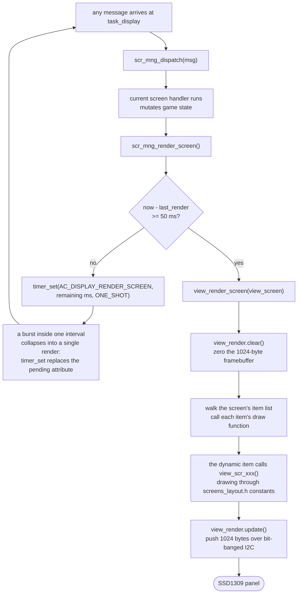

The push in the last step blocks the calling task for the whole transfer, so an uncapped burst of messages turns directly into a burst of blocking I2C writes. Measured on a 4-second synthetic burst scenario in the harness:

| | Full-frame I2C pushes | Final frame |
| --- | :---: | --- |
| Without the cap | 446 | identical |
| With the 50 ms cap | 73 | identical |

**Layout constants.** Every screen draws inside a 3 px margin using the shared constants, so nothing has to be re-tuned per screen:

```c
#define SCR_PAD_L        (3)          /* leftmost drawable column   */
#define SCR_PAD_R        (124)        /* rightmost drawable column  */
#define SCR_PAD_T        (3)          /* topmost drawable row       */
#define SCR_PAD_B        (60)         /* bottommost drawable row    */
#define SCR_ROW_TITLE    (3)
#define SCR_ROW_RULE     (11)
#define SCR_ROW_BODY     (15)
#define SCR_ROW_HINT     (53)
#define SCR_CENTER_X(n)  (SCR_PAD_L + ((SCR_USABLE_W - ((n) * SCR_CHAR_W)) / 2))
```

Two places bleed past the margin on purpose: the corridor band in the travel view, because a path that stops short of the edge does not read as a corridor, and the bouncing-ball screen saver, which is supposed to hit the edges.

> `glcdfont` is **5x8**, not 5x7. Text drawn at cursor `y` occupies `y..y+7`. Most glyphs only use the top 7 rows, which makes it easy to believe otherwise until a descender in `y`, `g`, `p` or `q` lands on row 8 and breaks the bottom margin.

---

## X. Combat Turn State Machine

A turn is not one function call. It is a sequence of phases advanced by the 100 ms tick, so the animation has time to play and the state stays inspectable at every step. `battle_wait_ticks` counts down inside each phase.

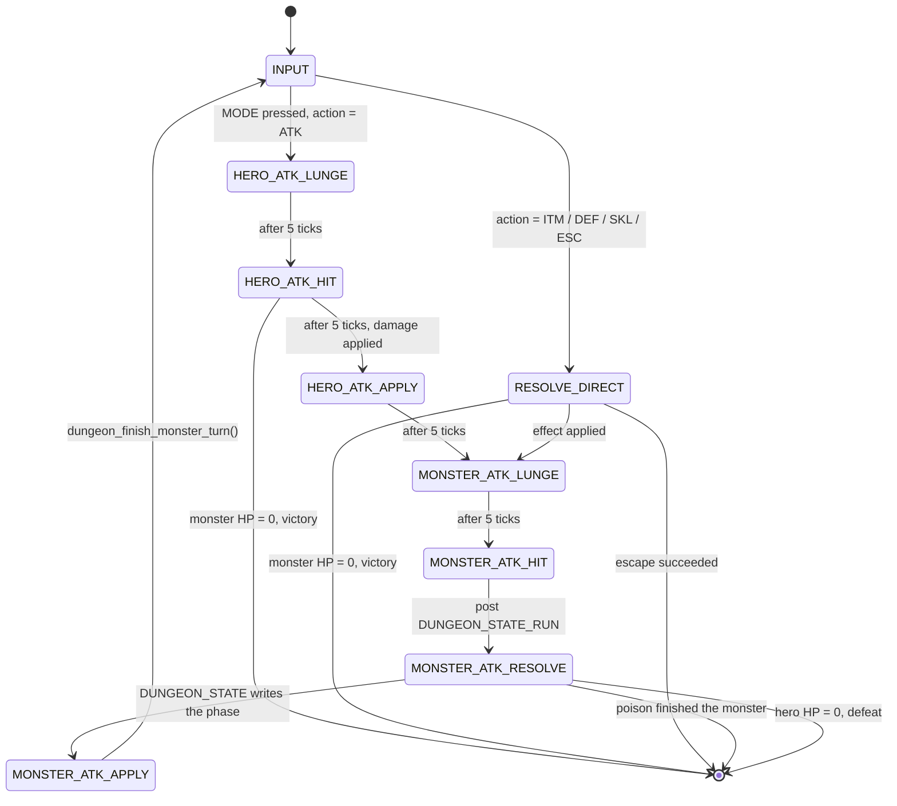

### The one deliberate shared-state write

Every other interaction between game tasks is a message. This one is not, and it is worth understanding before changing anything in `dungeon_state.cpp`.

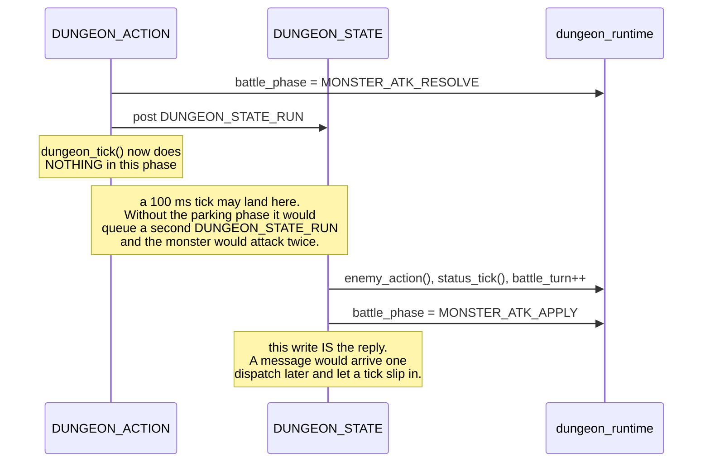

Two consequences to keep in mind:

- `dungeon_tick()` must keep its empty `MONSTER_ATK_RESOLVE` branch. Deleting it as dead code reintroduces the double-attack bug.
- `DUNGEON_STATE_SETUP` deliberately does **not** call `dungeon_set_monster_stats()`. The monster is established by `dungeon_prepare_stage()` on a fresh stage or by `dungeon_restore_save()` on a continue; re-rolling it at setup would heal a wounded monster to full HP every time the player resumes.

The phase enum is **append-only**. `MONSTER_ATK_RESOLVE` was added at the end rather than in logical order, because the numeric values are written to EEPROM by firmware already in the field.

---

## XI. Save System and Power-Loss Safety

Every record in the internal EEPROM is stored as `[magic][payload][checksum]`. A record that fails either test falls back to compiled-in defaults rather than handing garbage to the game.

| Address | Record | Size | Contents |
| --- | --- | :---: | --- |
| `0x0100` | Settings | 9 B | Silent flag, party size, anim speed, monster speed |
| `0x0120` | Best score | 17 B | Best score, best level, best stage |
| `0x0140` | Run in progress | 56 B | Level, stage, HP, ATK, DEF, monster stats, current view, inventory, status effects, message target |
| `0x0200` | Last run score | 9 B | Score of the most recently finished run |

### XI.1 Where a save happens

`dungeon_save_progress()` is called at every point where losing the state would be visible to the player. That is roughly every 100 ms during a fight and after every player decision.

```mermaid
flowchart LR
    subgraph T["the 8 call sites"]
        A["prepare_stage() - new stage"]
        B["confirm_action() - each of the 5 actions"]
        C["dungeon_tick() - each battle phase transition"]
        D["apply_chest_item() - item taken"]
        E["after_battle_win() - monster down"]
        F["finish_monster_turn() - turn closed"]
        G["trigger_support() / start_battle()"]
        H["monster_turn() - after the AI acted"]
    end

    T --> GATE{"dungeon_persist_enabled?"}
    GATE -->|"0 - Creator Mode"| SKIP(["skip, nothing written"])
    GATE -->|1| PACK

    PACK["pack ~30 runtime fields<br/>into dungeon_game_save_t"]
    PACK --> SEAL["magic = DUN2, valid = 1<br/>check_sum = sum over offsetof(check_sum)"]
    SEAL --> WR["eeprom_write(0x0140, 56 bytes)"]
    WR --> BEST["dungeon_update_best_progress()<br/>-> best score record at 0x0120"]
```

### XI.2 What Continue actually does

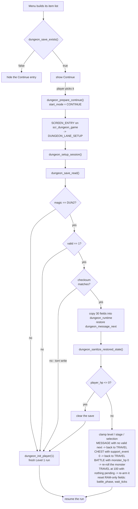

### XI.3 Three bugs this design exists to prevent

All three presented identically: *press **Continue**, the screen freezes and no button does anything.*

**1. State that only lived in RAM.** `dungeon_message_next` decides where pressing Mode on a message box leads. It was not part of the save record, so after a reset it read back as `DUNGEON_NEXT_NONE`, which matches no branch in `dungeon_confirm_action()` — the handler simply returned. The message box is also the most likely place to lose power, since it is shown before every fight and after every chest. Fixed by persisting the field.

**2. States that are syntactically valid but cannot progress.** For example `view = TRAVEL`, `travel_progress = 100`, `support_pending = 0`: the hero stands at the end of the corridor while `dungeon_advance_travel()` clamps at 100 forever without triggering anything. `dungeon_sanitize_restored_state()` sweeps for these after every restore and nudges the run back onto a reachable path, preferring *"always playable"* over *"restored perfectly"*.

**3. Torn EEPROM writes.** The save record is 56 bytes. Lose power mid-write and the head is new while the tail is old. `magic` lives in the first four bytes and is therefore almost always already committed, so a magic-only check accepts the mixed record. Adding a checksum fixed it:

| Validation rule | Torn records accepted |
| --- | :---: |
| magic + valid flag only *(previous)* | **47 / 47** |
| magic + valid flag + checksum *(current)* | **0 / 47** |

One trap worth repeating: the checksum length must come from `offsetof`, never `sizeof - 1`.

```c
#define DUNGEON_SAVE_CHECKSUM_SIZE  ((uint32_t)offsetof(dungeon_game_save_t, check_sum))
```

The struct is 4-byte aligned because of the leading `uint32_t magic`, so `check_sum` sits at offset 52 while `sizeof` is 56. Using `sizeof - 1` folds the checksum byte and three padding bytes into the sum, which then never matches on read-back. The symptom is silent and easy to misread: the menu simply stops offering **Continue**.

```text
dungeon_game_save_t - 56 bytes on the wire (offsets verified with offsetof)

byte  0    4  5    6      7       8      10                        26
      +----+--+----+------+-------+------+-------------------------+
      |magic|va|level|stage|total  |score | int16 x8: hp, max_hp,   |
      |DUN2 |lid|     |     |stages|      | atk, def, monster stats |
      +----+--+----+------+-------+------+-------------------------+

byte 26                            41         48      51 52    53   56
      +-----------------------------+----------+-------+--+----+-----+
      | uint8 x15: view, monster,   |inventory |chest  |ms|cs  | pad |
      | selection, status counters, |   [7]    |  [3]  |g |    |     |
      | travel_progress             |          |       |  |    |     |
      +-----------------------------+----------+-------+--+----+-----+
                                                          ^
                             check_sum sits at 52; the sum covers
                             bytes 0..51 and nothing after it
```

### XI.4 Verification

This project is developed alongside a host harness that compiles the **real** AK kernel and the **real** game logic against stub hardware, so behaviour can be exercised without a board.

| Check | Method | Result |
| --- | --- | :---: |
| Save recoverability | Sweep 3072 save states, restore each, drive 600 ticks of button input, flag any state that never changes | 0 frozen |
| Torn write rejection | Splice an old and a new record at all 47 interior byte offsets | 0 accepted |
| Screen margin compliance | Dump each framebuffer, scan all 8192 pixels against the 3 px margin | 0 violations |
| Timer lifecycle | Enter and leave the title screen, assert the periodic blink timer is removed | 0 leaks |
| Refactor safety | FNV-1a hash of framebuffer plus game state sampled every 50 ms, diffed before and after | byte-identical |

---

## XII. Build and Flash

### Option 1 - build from source

**1. Check the toolchain**

```bash
arm-none-eabi-gcc --version
```

**2. Build**

```bash
cd application
make
```

This produces `build_dungeon-game/dungeon-game.bin`.

> Run `make clean` first after changing a header or a `Makefile.mk` — the build does not track header dependencies across module boundaries.

**3. Flash**

Over the kit's USB serial port with `ak-flash`:

```bash
make flash dev=/dev/ttyUSB0
```

Or with an ST-LINK probe:

```bash
make flash
```

### Option 2 - restore the factory image

```bash
cd application
make factory dev=/dev/ttyUSB0
```

### Serial debug log

```bash
make com dev=/dev/ttyUSB0
```

`minicom` at 115200 baud. With `APP_DBG_EN` defined the firmware prints every dispatched signal, which is the fastest way to watch the message flow from sections VII and VIII happen live.

---

## XIII. Desktop Simulator

`tools/simulator/` builds the **real** firmware for macOS or Linux. Same AK kernel, same six game tasks, same combat logic, same EEPROM records — only the hardware is faked. No `arm-none-eabi-gcc`, no external libraries; the clang that ships with Xcode Command Line Tools is enough.

```bash
cd tools/simulator
make
./dungeon-sim          # draw straight into the terminal
./dungeon-sim --web    # open http://localhost:8080, looks like the device
```

| Key | Board button |
| --- | --- |
| `↑` / `W` | UP |
| `↓` / `S` | DOWN |
| `Enter` / `Space` / `M` | MODE |
| `Shift` + the above | long press |
| `R` | Reset |

The EEPROM is backed by a real file, so `kill -9` is a genuine power cut at whatever millisecond you choose — which is exactly how the save bugs in [section XI](#xi-save-system-and-power-loss-safety) are reproduced:

```bash
./dungeon-sim --web --wipe     # fresh run, empty EEPROM
# play until you are sitting on a message box, then, in another terminal:
pkill -9 -x dungeon-sim        # power cut, nothing else gets written
./dungeon-sim --web            # power back on - Continue must be there,
                               # and must drop you exactly where you stopped
```

```bash
xxd -s 0x0140 -l 64 dungeon-sim.eeprom   # first four bytes: 44 55 4e 32 = "DUN2"
```

The simulator hooks into `task_polling_console()`, which the kernel already calls once per `task_run()` iteration — so **not a single line under `ak/` is modified**. See [tools/simulator/README.md](tools/simulator/README.md) for what is faithful and what is faked.

---

## Repository Layout

```text
application/
  sources/
    ak/             AK kernel: scheduler, message pools, software timers
    app/
      screens/      12 screens, shared layout constants, bitmaps
      game/
        dungeon_game/   6 game tasks: lane, action, state, control, effect, runtime
      task_list.cpp     the task table: id, priority, handler
      app_eeprom.cpp    validated EEPROM access, checksums
      app_bsp.cpp       button callbacks, signal routing
      app.cpp           main_app(), boot order
    common/         screen manager, view render, containers
    driver/         OLED, EEPROM, NOR flash, button, buzzer, GPIO, LED
    platform/       STM32L151 pin map and low-level init
    sys/            system init, debug, fatal handler
boot/               AK bootloader
tools/simulator/    run the firmware on a laptop, terminal or browser
docs/               source walkthrough, 13 chapters
hardware/           schematics, board images, BOM, gerbers
resources/          banner, screen captures, sprite sheets
```

---

## License

MIT — see [LICENSE](LICENSE).

## Contact

**An Nguyen Khanh** — Embedded Software

```text
Thanks for stopping by. Questions about the architecture, the save system,
or the AK kernel itself are very welcome.
```

[](https://github.com/annguyenkhanh)

Built on the [AK Embedded Base Kit](https://github.com/the-ak-foundation/ak-base-kit-stm32l151) by the AK Foundation.
