<div align="center">


<br>


</div>

# Lone-Blade - Game built on AK Embedded Base Kit

<center>
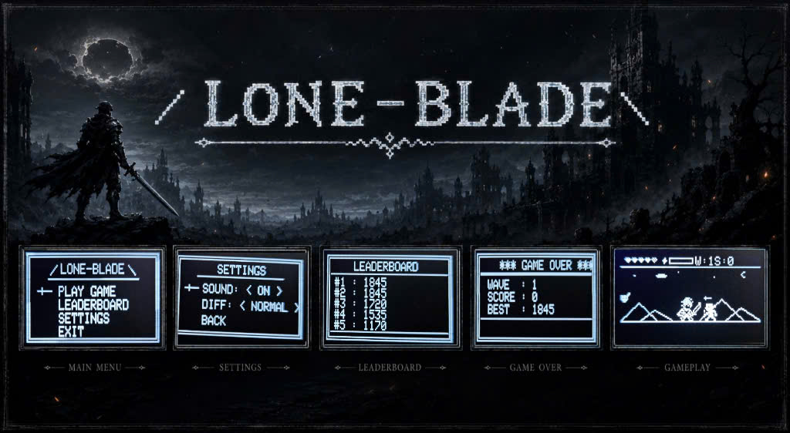
</center>

<hr>

## Gameplay Demo

<div align="center">
  <video src="https://github.com/user-attachments/assets/lone-blade-gameplay-demo.mp4" controls width="480"></video>
</div>

## Documentation

| File | Description |
|---|---|
| [README.md](README.md) | Main project overview, hardware specs, game mechanics, objects, and HUD design. |
| [docs/01-guide-getting-started.md](docs/01-guide-getting-started.md) | Guide to setup Ubuntu environment, compile Makefile, and flash STM32 firmware. |
| [docs/02-guide-coding-rules.md](docs/02-guide-coding-rules.md) | Coding conventions, project structure, and event-driven software design rules. |
| [docs/03-design-sequence-object.md](docs/03-design-sequence-object.md) | Object design, state machines, and Mermaid sequence diagrams for Hero, Boss, Enemies, and Ult. |
| [docs/04-design-sequence-runtime.md](docs/04-design-sequence-runtime.md) | Runtime signal-processing flow, 33ms game loop tick, AK OS task architecture, and screen transitions. |
| [docs/05-flash-data-storage.md](docs/05-flash-data-storage.md) | Flash Sector 0x6000 layout, Top-5 Leaderboard persistence, Magic Number validation, and score continuation. |

## Introduction

**Lone-Blade** is an action side-scrolling wave survival and Boss-rush game built on the **AK Embedded Base Kit**, powered by the **Active Kernel (AK)** event-driven framework. The player controls a knight defending against flying monsters, armored swordsmen, and multi-phase Bosses.

While building and playing Lone-Blade, you put the following core concepts of modern embedded engineering into practice:

- **System design:** Modelling complex logic flows and state machines with UML & Mermaid.
- **Process management:** Coordinating cooperative Active Kernel Tasks and driving periodic timer ticks.
- **Communication:** Using Signals, Timers, and Messages to react in real time to button IRQs and combat collisions.
- **Non-volatile storage:** Storing Top-5 leaderboards into STM32 Flash Sector `0x6000` with magic validation.

### I. Hardware

<table align="center">
  <tr>
    <td align="center"></td>
  </tr>
</table>
<p align="center"><strong><em>Figure 1:</em></strong> AK Embedded Base Kit - STM32L151</p>

The [AK Embedded Base Kit](https://epcb.vn/products/ak-embedded-base-kit-lap-trinh-nhung-vi-dieu-khien-mcu) is an evaluation kit for advanced embedded software learners.

It integrates a **1.54" OLED LCD (128x64 px)**, **3 push buttons**, and a **PWM Buzzer** capable of playing melody sequences. It also exposes **RS485**, **Qwiic**, and **Grove** connectors.

**MCU Overview:**

```text
SoC Name : STM32L151CBT6
RAM      : 16 KB

Flash Partitions Layout
----------------------
[ 0x08000000 - 0x08001FFF ] : Bootloader Partition (8 KB)
=> AK Bootloader

[ 0x08002000 - 0x08002FFF ] : BSF Shared Partition (4 KB)
=> Used for data sharing between Bootloader and Application

[ 0x08003000 - 0x0801FFFF ] : Application Firmware Partition (116 KB)
=> Lone-Blade Firmware

[ Sector 0x6000 ]           : Game Non-Volatile Storage Partition (4 KB Sector)
=> Top-5 High Score Leaderboard & Magic Validation Data
```

**MCU Naming Convention:**

| Part | Meaning |
|---|---|
| `STM32` | STMicroelectronics 32-bit MCU family. |
| `L` | Low-power series. |
| `151` | STM32L151 product line. |
| `C` | 48-pin package. |
| `B` | 128 KB Flash memory. |
| `T` | LQFP package. |
| `6` | Industrial temperature grade. |

<table align="center">
  <tr>
    <td align="center">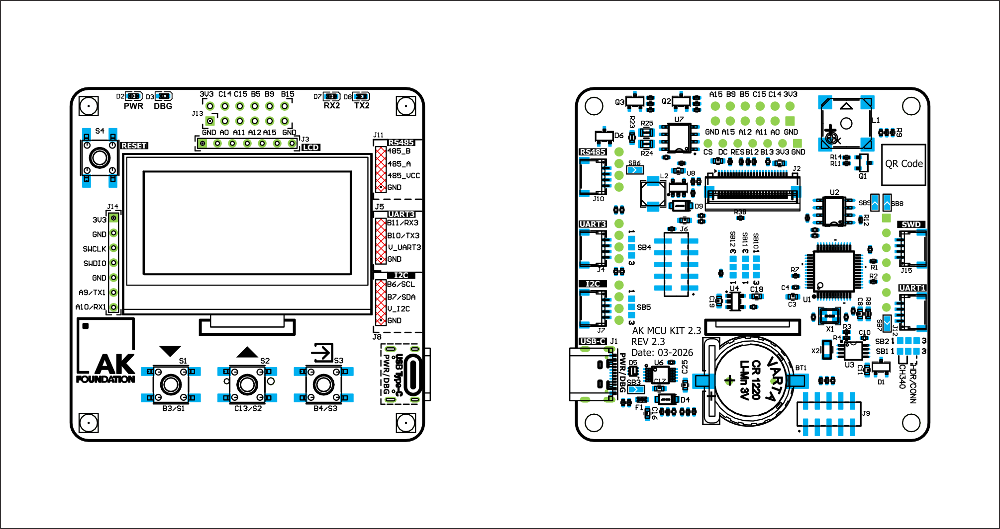</td>
  </tr>
</table>
<p align="center"><strong><em>Figure 2:</em></strong> Board view Top + Bottom</p>

---

### II. Game Description and Objects

The game boots through: **Startup (AK Logo)** → **Welcome Screen Preview** → **Main Menu**.

<table align="center">
  <tr>
    <td align="center">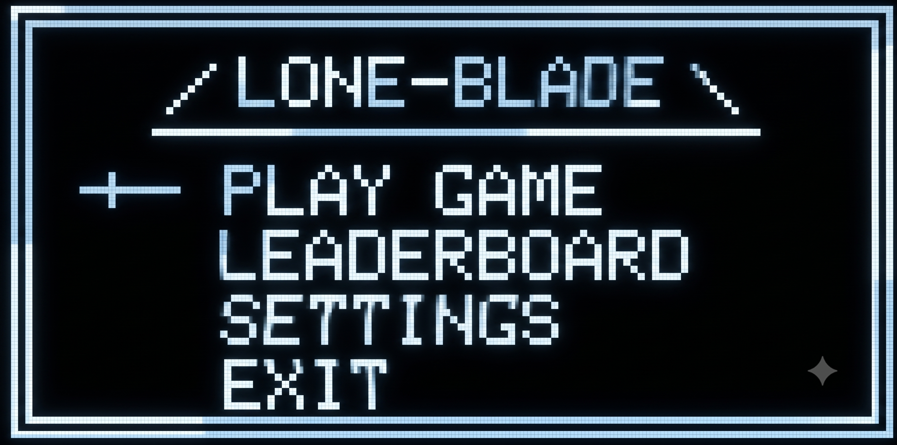</td>
  </tr>
</table>
<p align="center"><strong><em>Figure 3:</em></strong> Main Menu screen</p>

The **Main Menu** provides four choices:
- **Play Game:** Start a new survival match.
- **Leaderboard:** View Top-5 high scores loaded from Flash memory (`Sector 0x6000`).
- **Settings:** Configure game difficulty (Easy, Normal, Hard) and sound ON/OFF.
- **Exit:** Return to idle welcome screen.

<table align="center">
  <tr>
    <td align="center">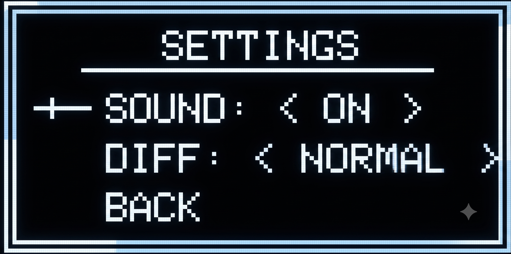</td>
    <td align="center">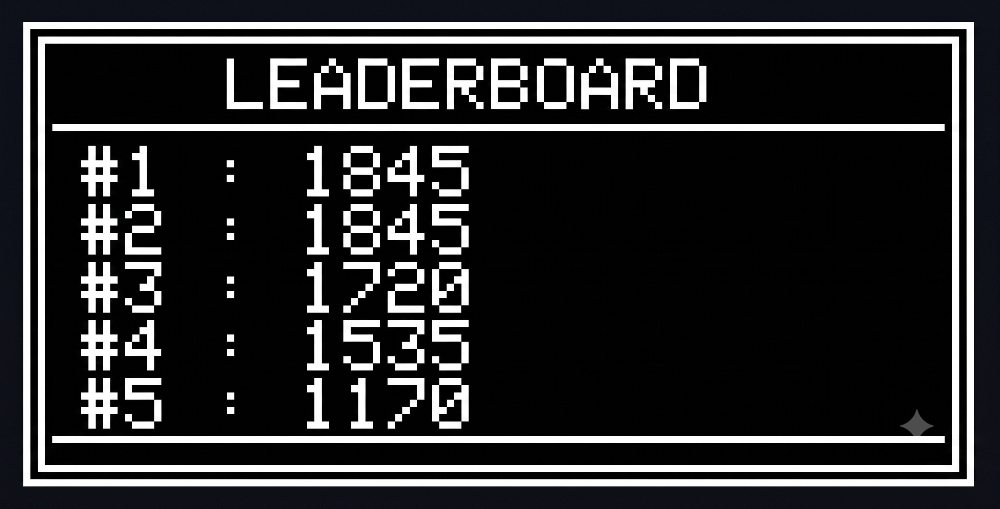</td>
  </tr>
</table>
<p align="center"><strong><em>Figure 4:</em></strong> Settings Menu & Top-5 Leaderboard Screen</p>

<table align="center">
  <tr>
    <td align="center">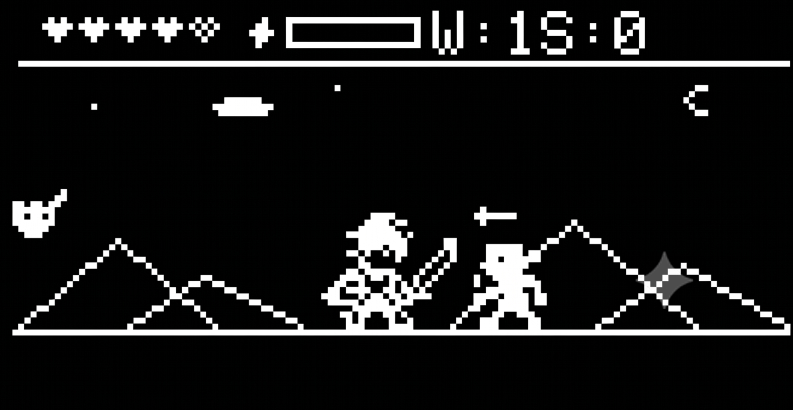</td>
  </tr>
</table>
<p align="center"><strong><em>Figure 5:</em></strong> Gameplay screen with pixel HUD and parallax background</p>

#### Game Objects:

| Bitmap | Object Name | Description |
| :---: | :--- | :--- |
| 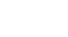 | **Hero (Knight)** | Player character. Attacks Left/Right, raises Shield to Parry, and fires Ult Wave when Mana = 100%. |
|  | **Flying Monster** | Fast aerial threat. Destroying it awards **+5 pts**. |
| 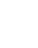 | **Normal Monster** | Ground melee enemy. Destroying it awards **+10 pts**. |
| 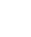 | **Armored Knight** | Heavy ground enemy requiring multiple slashes. Destroying it awards **+20 pts**. |
| 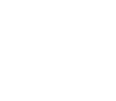 | **Boss** | Spawns at Wave 3 (25 HP) & Wave 5 (40 HP). Features Enraged Phase 2 at <= 50% HP. Defeating awards **+300 pts**. |
|  | **Arrow Hazard** | Fast horizontal projectile crossing the screen. Can be blocked with Shield. |
|  | **Ultimate Wave** | Piercing energy shockwave cutting across the field to destroy all enemies in line. |
|  | **Health Potion** | Random drop that restores +1 HP when collected. |

---

### III. How to Play

- Press **[Down]** to Slash Left / Navigate menu down.
- Press **[Up]** to Slash Right / Navigate menu up.
- Press **[Mode]** to raise Shield (Parry incoming strikes & fireballs). When Mana = 100%, pressing **[Mode]** unleashes the Ultimate Wave!

#### Game Mechanics:

- **Kill-Only Scoring System:** Points are earned strictly when an enemy is defeated:
  - Flying Monster: **+5 pts**
  - Normal Monster: **+10 pts**
  - Armored Knight: **+20 pts**
  - Wave Survival Bonus: **+100 pts** per wave
  - Boss Defeat: **+300 pts**
- **Parry & Mana System:** Successfully blocking or reflecting enemy attacks charges Mana. Reaching 100% enables the Ultimate Wave.
- **Victory Condition:** Defeat the Wave 5 Boss to win. Victory screen plays the *Super Mario Bros* theme and presents the option to **PLAY HARD** (carrying your current score into Hard mode to set a new record).
- **Defeat Condition:** Losing all 5 HP triggers Game Over, accompanied by dynamic Highscore / Lowscore audio feedback.
- **Non-Volatile Leaderboard:** High scores and Top-5 entries are saved to Flash Sector `0x6000` with `0xABCD1234` magic validation.

<table align="center">
  <tr>
    <td align="center">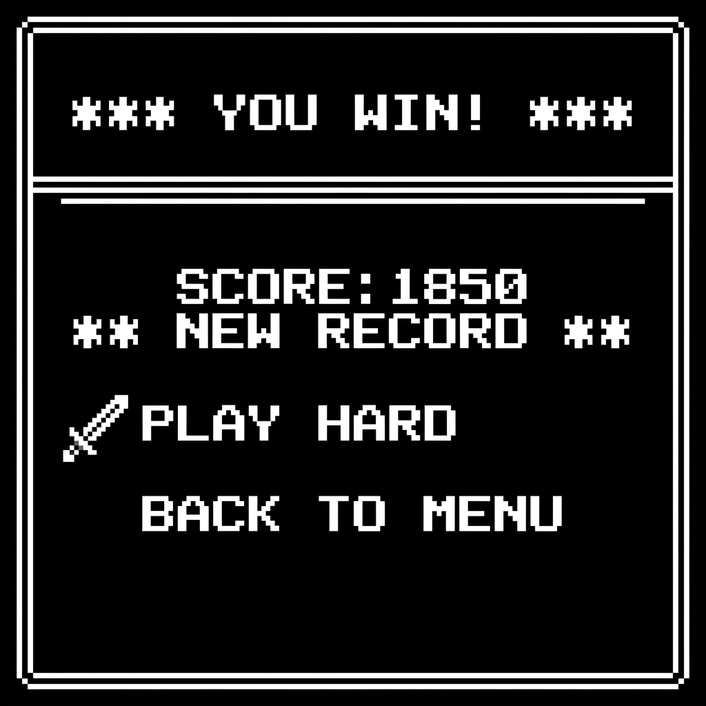</td>
  </tr>
</table>
<p align="center"><strong><em>Figure 6:</em></strong> Victory screen with PLAY HARD option</p>

<table align="center">
  <tr>
    <td align="center">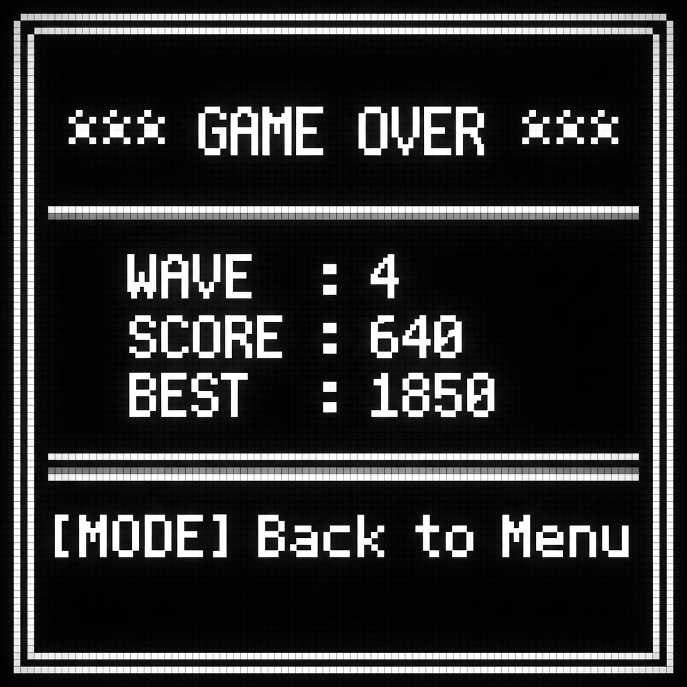</td>
  </tr>
</table>
<p align="center"><strong><em>Figure 7:</em></strong> Game Over screen showing final score and high score record</p>

---

### IV. Basic Game Sequence Logic

```mermaid
%%{init: {'theme':'dark', 'sequence': {'actorMargin': 50}}}%%
sequenceDiagram
    autonumber
    actor Player
    participant AK as AK Kernel
    participant Scr as Screen Manager
    participant Hero as Hero Module
    participant Boss as Boss Module
    participant Flash as Flash Memory

    Note left of Player: SCREEN_ENTRY
    AK->>Scr: SCREEN_ENTRY (scr_game_playing)
    Scr->>Flash: game_load_flash_data()
    Flash-->>Scr: Load Top-5 & High Score
    Scr->>Hero: player_init()
    Scr->>Boss: game_boss_init()
    
    rect rgb(30, 50, 30)
        Note left of Player: GAME LOOP (33 ms tick)
        AK->>Scr: AC_DISPLAY_GAME_TICK
        Scr->>Hero: player_update(33)
        Scr->>Boss: game_boss_update(33)
        Scr->>Scr: Check Combat & Parry
        Scr->>Scr: Render HUD & Sprites
    end

    alt Defeat
        Scr->>Flash: game_update_high_score()
        Scr->>AK: SCREEN_TRAN(scr_game_over)
    else Victory (Wave 5 Boss Defeated)
        Scr->>Flash: game_update_high_score()
        Scr->>AK: SCREEN_TRAN(scr_game_win)
    end
```

---

## Contact & Support

<p style="font-size: 20px;"><strong>Lone-Blade Embedded Game Team</strong> - AK Base Kit Project</p>

``` Note
Thank you for visiting this repository.
If you have any questions or feedback about the firmware or game mechanics, feel free to submit an issue or pull request.
```

<a href="https://github.com/the-ak-foundation">
  
</a>
