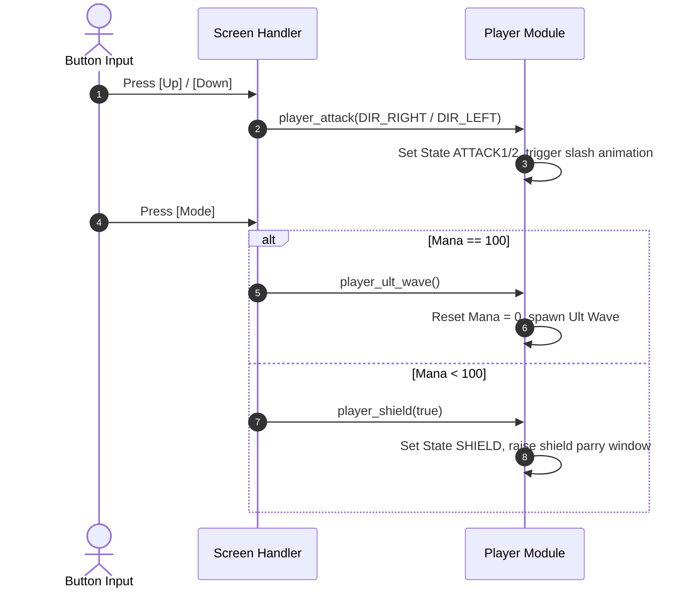
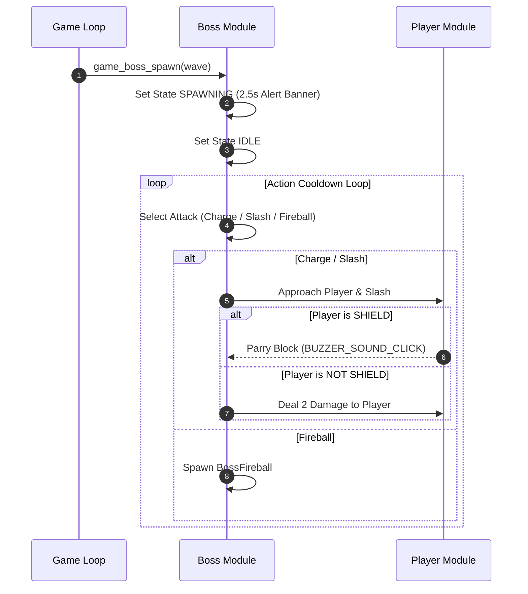
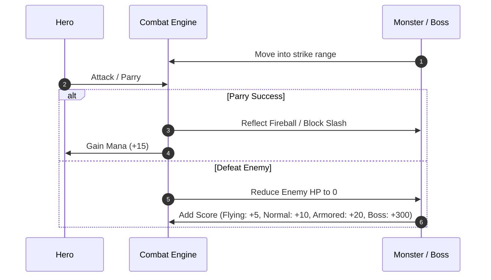

<h1 align="center">Game Object Sequences</h1>

This document describes the runtime sequence and state management of each main object in **Lone-Blade**.

---

## I. Object Summary

| Object | File / Module | Main Responsibility |
|---|---|---|
| **Hero (Knight)** | `game_player.cpp` | Manages player position, HP (5 hearts), Mana (0-100%), Shield Parry state, and Ult Wave activation. |
| **Monsters** | `game_monster.cpp` | Spawns and moves Flying (+5 pts), Normal (+10 pts), and Armored Knights (+20 pts). |
| **Boss System** | `game_boss.cpp` | Handles Wave 3 (25 HP) & Wave 5 (40 HP) Bosses with Enraged Phase 2 when HP <= 50%. |
| **Arrow Hazard** | `game_arrow.cpp` | Spawns fast horizontal projectiles crossing screen. |
| **Ultimate Wave** | `game_ult_wave.cpp` | Piercing energy wave cutting across screen when Mana = 100%. |
| **Health Potion** | `game_item.cpp` | Drops random health pickup restoring +1 HP. |

---

## II. Detailed Object Sequences

### 1. Hero State Machine & Input Sequence

---

### 2. Boss System Sequence (Wave 3 & Wave 5)

---

### 3. Combat Collision & Scoring Sequence

