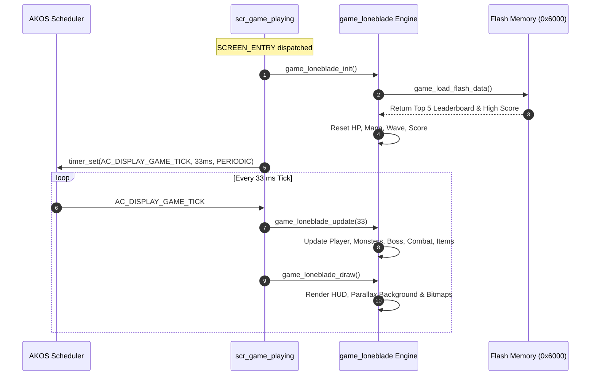
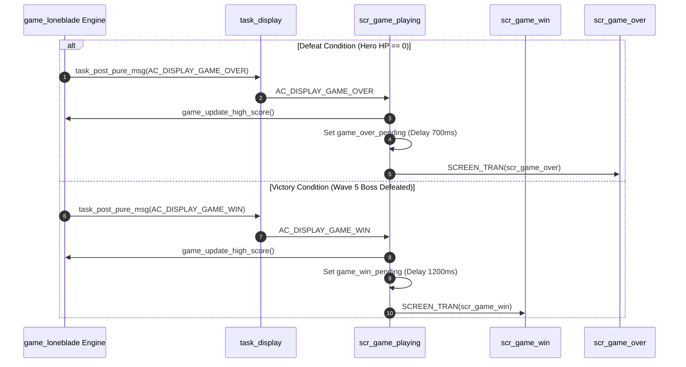

<h1 align="center">Runtime Signal Processing</h1>

This document details the Active Kernel (AK Framework) event-driven signal processing, periodic game timer ticks, and screen transitions in **Lone-Blade**.

---

## I. System Overview

Lone-Blade uses an event-driven task architecture:
- Display task (`AC_TASK_DISPLAY_ID`) manages screen handlers and processes incoming signals.
- Game loop execution is driven by a periodic timer signal:
  ```c
  AC_DISPLAY_GAME_TICK (33 ms interval => ~30 FPS)
  ```
- Signal Flow:
  1. Hardware button IRQ or timer triggers software signal.
  2. Signals are enqueued in the AK message pool.
  3. AK Scheduler dispatches messages to the active screen handler.
  4. Object modules update internal state non-blockingly.
  5. Screen buffer is cleared and re-rendered (`game_loneblade_draw`).

---

## II. Runtime Signals

| Signal Name | Source | Destination | Description |
|---|---|---|---|
| `AC_DISPLAY_INITIAL` | Boot | `AC_TASK_DISPLAY_ID` | System display initialization. |
| `AC_DISPLAY_BUTON_UP_PRESSED` | Key IRQ | Active Screen | Up button pressed (Slash Right / Menu Up). |
| `AC_DISPLAY_BUTON_DOWN_PRESSED` | Key IRQ | Active Screen | Down button pressed (Slash Left / Menu Down). |
| `AC_DISPLAY_BUTON_MODE_PRESSED` | Key IRQ | Active Screen | Mode button pressed (Shield/Ult / Menu Select). |
| `AC_DISPLAY_GAME_TICK` | Timer | `scr_game_playing` | 33ms game update tick. |
| `AC_DISPLAY_GAME_OVER` | Game Engine | `scr_game_playing` | Triggered on Hero HP = 0. |
| `AC_DISPLAY_GAME_WIN` | Game Engine | `scr_game_playing` | Triggered on Wave 5 Boss defeat. |
| `AC_DISPLAY_GAME_WIN_BLINK` | Timer | `scr_game_win` | 500ms blink timer for victory menu option. |

---

## III. Sequence Flow Diagrams

### 1. Game Initialization & Loop



---

### 2. Defeat & Victory Transitions


